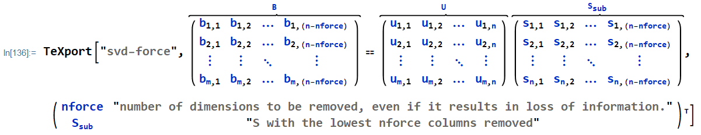

# Mathematica

## TeXport
### Beginner  
#### Code
```
keys = {a, b, c};
values = {"apples", "bananas", "cantaloupe"};
equation = a + b == c;
keyvalues = {keys, values};
printQ = True;
fname = "texport-example";
TeXport[fname, equation, keyvalues, printQ]
```
Set `printQ` to `False` if you want to export to a file named `fname`(`.tex` extension added automatically). Set to `True` if you want to only Print to `$Output` (Mathematica's `stdout` so to speak).
#### Output
> \begin{equation} \label{eq:texport-example}  
> a+b=c  
> \end{equation}  
> where $a$, $b$, and $c$ represent apples, bananas, and cantaloupe, respectively.

### Intermediate
If you're new to Mathematica altogether, start with the [Documentation Home](https://reference.wolfram.com/language/) and look at the linked [Working in Notebooks](https://reference.wolfram.com/language/workflowguide/WorkingInNotebooks). If you're less familiar with typesetting equations in Mathematica, start by reading this [typesetting guide](http://reference.wolfram.com/language/guide/MathematicalTypesetting.html), then in a Mathematica notebook, go to:
`Menu Bar --> "Palettes" --> "Basic Math Assistant"`.
Hover over the various boxes to see the corresponding shortcuts. I recommend using the shortcuts for efficiency, but you can also click on the boxes. If you're interested in the inner-workings of the code, see also [String Manipulation Guide](https://reference.wolfram.com/language/guide/StringManipulation.html). The [Mathematica Stack Exchange](https://mathematica.stackexchange.com) is another great resource, and many Google searches will direct you to there.
#### Code


#### Output
```
\begin{equation} \label{eq:svd-force}
	\overbrace{\left(
\begin{array}{cccc}
 b_{1,1} & b_{1,2} & \ldots  & b_{1,n-\text{nforce}} \\
 b_{2,1} & b_{2,2} & \ldots  & b_{2,n-\text{nforce}} \\
 \vdots  & \vdots  & \ddots & \vdots  \\
 b_{m,1} & b_{m,2} & \ldots  & b_{m,n-\text{nforce}} \\
\end{array}gp
\right)}^B=\overbrace{\left(
\begin{array}{cccc}
 u_{1,1} & u_{1,2} & \ldots  & u_{1,n} \\
 u_{2,1} & u_{2,2} & \ldots  & u_{2,n} \\
 \vdots  & \vdots  & \ddots & \vdots  \\
 u_{m,1} & u_{m,2} & \ldots  & u_{m,n} \\
\end{array}
\right)}^U \overbrace{\left(
\begin{array}{cccc}
 s_{1,1} & s_{1,2} & \ldots  & s_{1,n-\text{nforce}} \\
 s_{2,1} & s_{2,2} & \ldots  & s_{2,n-\text{nforce}} \\
 \vdots  & \vdots  & \ddots & \vdots  \\
 s_{n,1} & s_{n,2} & \ldots  & s_{n,n-\text{nforce}} \\
\end{array}
\right)}^{S_{\text{sub}}}
\end{equation}
where $\text{nforce}$ and $S_{\text{sub}}$ represent number of dimensions to be removed (even if it results in loss of information) and $S$ with the lowest nforce columns removed, respectively.
```

#### Typeset Output  


### Advanced
You can also perform symbolic computations for a proof and export the entire proof with intermediate commentary as a `.tex` file. I have done this for a paper I'm working on and will probably put an example together for this. Open up an issue if you'd like to see this sooner.

### LaTeX
Once you have your equation `.tex` files (I suggest putting these in an "equations" folder in your paper repo), commit and push them, and reference the equations in the LaTeX body using e.g. `\cref{eq:svd-force}` from the `cleveref` package.
